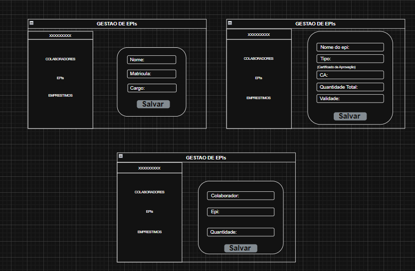

Sistema de Gerenciamento de EPIs
Descrição do Projeto
Este projeto tem como objetivo desenvolver um sistema de gerenciamento de Equipamentos de Proteção Individual (EPIs) para uma empresa de construção civil. A aplicação visa melhorar o controle sobre o uso dos EPIs, garantindo a segurança dos colaboradores e a conformidade com as normas regulamentadoras.

Funcionalidades Principais
Gestão de Colaboradores: Um CRUD (Create, Read, Update, Delete) para gerenciar o cadastro completo de todos os colaboradores da empresa.

Gestão de EPIs: Cadastro de EPIs, controle de estoque e monitoramento de datas de validade.

Empréstimo de EPIs: Registro de empréstimos e devoluções de EPIs para cada colaborador.

Relatórios: Geração de relatórios de uso e de estoque para auditorias internas.

Protótipos de Interface

Telas Representadas:
Cadastro de Colaboradores - Formulário com nome, matrícula e cargo

Cadastro de EPIs - Formulário com dados do EPI incluindo CA e validade

Registro de Empréstimos - Formulário para associar colaborador, EPI e quantidade

Estrutura do Banco de Dados

Requisitos do Sistema
Requisitos Funcionais
Estes requisitos descrevem o que o sistema deve fazer.

RF01 - Gerenciamento de Empréstimos e Status: O sistema deve permitir que o técnico de segurança registre o empréstimo de EPIs para um colaborador. Após o registro, o sistema deve atualizar automaticamente o status do item como "emprestado" e o status do colaborador como "com EPIs em uso".

RF02 - Gerenciamento de Colaboradores: O sistema deve permitir o cadastro, a edição e a exclusão de colaboradores, com informações como nome, cargo, número de registro e EPIs necessários.

RF03 - Gerenciamento de EPIs: O sistema deve permitir o cadastro, a edição e a exclusão de EPIs, incluindo informações como nome, descrição, quantidade em estoque e validade. O sistema deve também ser capaz de notificar sobre EPIs com estoque baixo ou próximos do vencimento.

RF04 - Controle de Empréstimo e Devolução: O sistema deve registrar o empréstimo de EPIs para um colaborador específico, vinculando o item à sua ficha. Deve também registrar a devolução do EPI, atualizando o estoque.

RF05 - Geração de Relatórios: O sistema deve ser capaz de gerar relatórios detalhados, como o histórico de empréstimos por colaborador, o inventário de EPIs em estoque e a lista de EPIs com validade próxima.

Requisitos Não Funcionais
Estes requisitos descrevem como o sistema deve funcionar, focando em atributos de qualidade.

RNF01 - Usabilidade: O sistema deve possuir uma interface de usuário intuitiva e de fácil navegação, permitindo que técnicos de segurança e administradores realizem as tarefas de cadastro e empréstimo de forma rápida.

RNF02 - Desempenho: O sistema deve ser capaz de processar as transações de empréstimo e devolução rapidamente, com um tempo de resposta inferior a 3 segundos, mesmo com um grande volume de dados.

RNF03 - Segurança: O sistema deve garantir a proteção dos dados dos colaboradores e do inventário de EPIs, com acesso controlado por meio de autenticação de usuário e diferentes perfis de permissão.

RNF04 - Disponibilidade: O sistema deve estar disponível 24 horas por dia, 7 dias por semana, com um tempo de inatividade (downtime) máximo de 1% do tempo de operação.

RNF05 - Conformidade: O sistema deve estar em conformidade com a Norma Regulamentadora 6 (NR-6), que trata do uso de EPIs, auxiliando a empresa a cumprir as diretrizes de segurança no trabalho.

Estrutura do Projeto

gestao_epi/
│
├── gestao_epi/                 # Configurações principais do Django
│   ├── __init__.py
│   ├── settings.py
│   ├── urls.py
│   └── wsgi.py
│
├── colaboradores/              # App para gerenciar o CRUD de colaboradores
│   ├── migrations/
│   ├── templates/
│   │   └── colaboradores/
│   │       ├── form.html
│   │       ├── lista.html
│   │       └── confirm_delete.html
│   ├── admin.py
│   ├── apps.py
│   ├── forms.py
│   ├── models.py
│   ├── urls.py
│   └── views.py
│
├── emprestimos/                # App para gerenciar o empréstimo e devolução de EPIs
│   ├── migrations/
│   ├── templates/
│   │   └── emprestimos/
│   │       ├── form.html
│   │       ├── lista.html
│   │       └── confirm_delete.html
│   ├── admin.py
│   ├── apps.py
│   ├── models.py
│   ├── urls.py
│   └── views.py
│
├── epis/                       # App para gerenciar o CRUD de EPIs
│   ├── migrations/
│   ├── templates/
│   │   └── epis/
│   │       ├── form.html
│   │       ├── lista.html
│   │       └── confirm_delete.html
│   ├── admin.py
│   ├── apps.py
│   ├── models.py
│   ├── urls.py
│   └── views.py
│
├── docs/                       # Documentação do projeto
│   ├── database_diagram.png    # Diagrama do banco de dados
│   └── wireframes.png          # Protótipos de interface
│
├── manage.py
├── requirements.txt
└── README.md

Tecnologias Utilizadas
Backend: Django 5.2.5, Python 3.12.4

Frontend: HTML, CSS

Banco de Dados: MySQL

Controle de Versão: Git e GitHub

Autor
Felipe Fernandes

